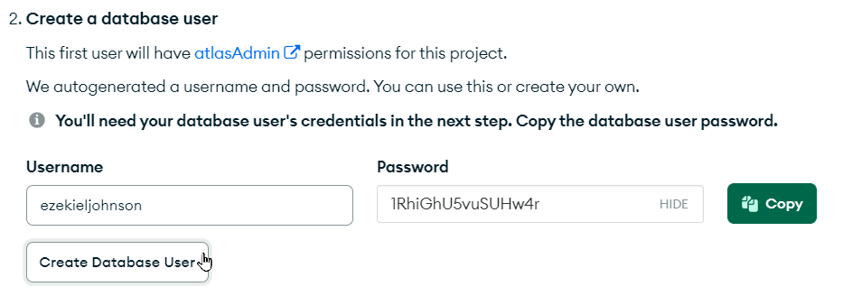
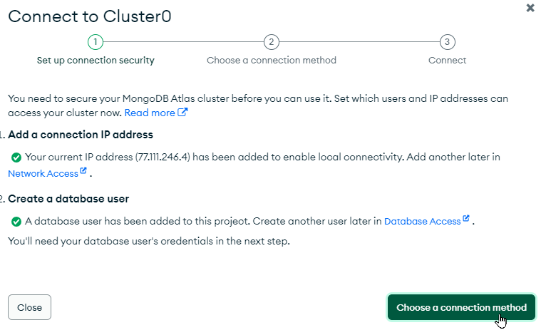
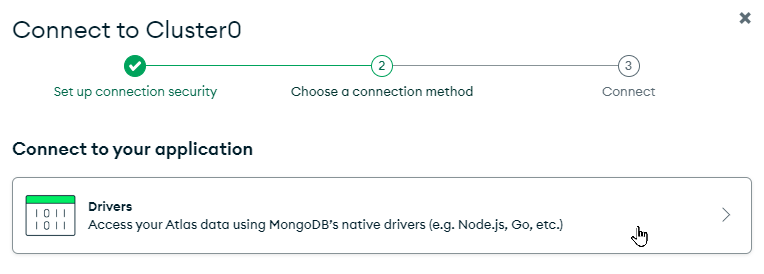

# MongoDB Atlas Setup
[MongoDB Atlas](https://www.mongodb.com/products/platform/atlas-database) is the cloud database service the app uses.

## Account Registration
The first step is to create an Atlas account. Follow these steps:

1. [Click here to go to the Account Registration page](https://www.mongodb.com/cloud/atlas/register)
1. Enter a first name, last name, email address, and password  
  - Make sure to remember your email address and password!!!!
1. Click the "I agree to the **Terms of Service** and **Privacy Policy**" checkbox
1. Click the "Create your Atlas account" button

  

1. Check your email inbox for a verification email from **MongoDB Cloud**
1. When the email arrives, click the "Verify Email" button

  

1. On the page that appears, click the "Continue" button

  

1. On the next page, fill out the form as desired, and click "Finish"

  

From there, just make sure to log the email address and password used to create the account.

## Deploying a Cluster
Next, it's time to get a cluster up and running! A cluster is basically a group of databases. The application will only use one database, but it will live in a cluster.

1. [Click here to go to the MongoDB login page](https://account.mongodb.com/account/login)
1. Enter the email address and password, and click the "Login" button
1. From the **Overview** page, click the "+ Create" button under "Create a cluster"

  

1. In the "Deploy your cluster" section, select the "**M0**" template on the right
1. Leave everything else the same
1. At the bottom of the screen, to the right, click the "Create Deployment" button

  

1. Complete the human verification if needed

Now the cluster should be deployed! The next step is to get the connection string for it.

## Getting the Connection String
It is possible to connect to a MongoDB Atlas cluster with a connection string - it's a short piece of text that tells an application how to connect to the cluster. Follow these steps to get the connection string for the newly-deployed cluster:

1. In the popup that appears, click the "Create Database User" button under step 2:

  

1. Next, click the "Choose a connection method" button in the bottom right of the pop-up:

  

1. In the next pop-up, click the "Drivers" box:

  

1. In the **Connecting with MongoDB Driver** pop-up, click the copy icon under step 3:

  

That should be it - that's the full connection string.

### After the Initial Setup
It may be necessary to get the connection string after the cluster's initial deployment. Follow these slightly different steps:

1. Click the "Connect" button from the **Overview** section in Atlas:

  

1. Click the "Drivers" box
1. On the next page, click the copy button:

  

Note that _this_ connection string will NOT work as copied - the `<password>` must be replaced with the database user's password. **This is a different password than the password for your MongoDB Atlas account** - it's the one created with the database user above. It is possible to reset the database user's password if needed:

1. Open the **Database Access** page under the **SECURITY** section on the left
1. Click the "EDIT" button next to the admin user

  

1. On that page, make sure "Password" is selected as the **Authentication Method**
1. Click the "Edit Password" button under **Password Authentication**
1. Enter a new password (or click "Autogenerate Secure Password" if desired)
1. Click the "Copy" button after the password has been entered
1. At the bottom of this pop-up, click the "Update User" button

  

Now, the connection string can be edited to include the updated password. First, make sure that the password is pasted somewhere. Then, replace `<password>` in the connection string with the password copied for the database user.

## Setting Up Network Access
By default, access to the database is restricted to certain networks. Because of the way this application should work, it will be necessary to allow authenticated users to connect to the cluster from _any_ IP address.

1. [Go back to MongoDB Atlas](https://cloud.mongodb.com/)
1. Open the **Network Access** page under the **SECURITY** section on the left
1. Click the "+ ADD IP ADDRESS" button on the right

  

1. In the pop-up that appears, click the "ALLOW ACCESS FROM ANYWHERE" button, and then click "Confirm"

  

At this point, the database should be fully connect-able.

## What's Next
The important thing is to copy the connection string - that's the thing that will allow for database connections to happen. There are a variety of ways this string can be sued, but for this application, it will be passed in a **.env** file.
